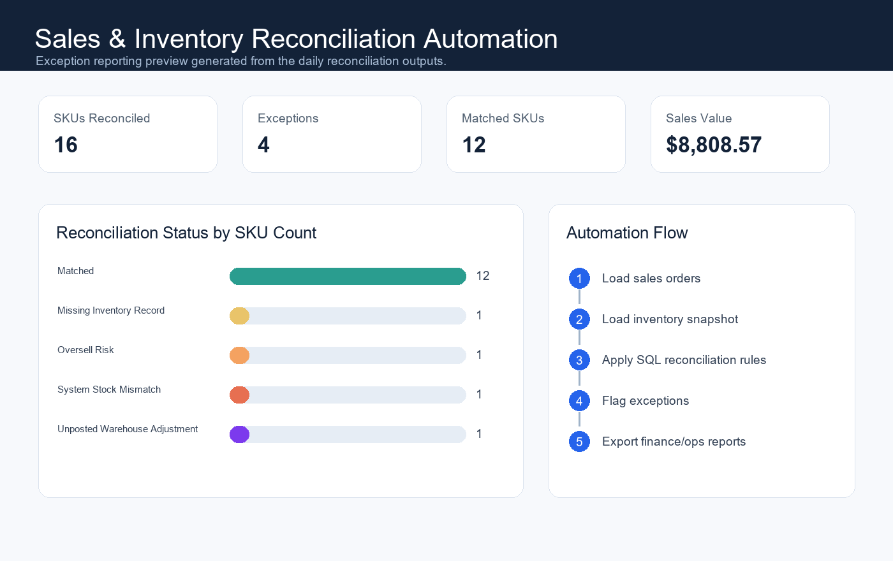

# Sales & Inventory Reconciliation Automation

This project automates daily reconciliation between sales orders, inventory snapshots, and warehouse adjustments. It demonstrates how manual spreadsheet checks can be translated into repeatable SQL and Python workflows.

## Business Problem

Operations and finance teams often compare order exports, inventory snapshots, and warehouse adjustment files manually. That creates repeated spreadsheet work, inconsistent checks, and delayed visibility into inventory issues.

This project automates that process by loading raw files, creating a local database, running reconciliation queries, and producing exception reports for finance and operations review.

## Dashboard Preview



## Tools Used

- Python for automation and report generation
- SQL for reconciliation business rules
- SQLite for local repeatable checks
- CSV outputs for finance, operations, and engineering review
- HTML dashboard prototype for portfolio presentation

## What This Project Shows

- Automated daily sales and inventory reconciliation workflow
- Exception reporting for stock mismatches, oversells, missing inventory records, and unposted warehouse adjustments
- Daily reporting pipeline that creates summary and exception outputs
- Clear technical specs for translating business rules into reusable data checks

## Latest Output Summary

- Sales rows loaded: 16
- Inventory rows loaded: 15
- Warehouse adjustment rows loaded: 4
- SKUs reconciled: 16
- Exceptions found: 4
- Reconciled sales value: $8,808.57

## Resume Framing

- Automated SQL and Python workflows reducing manual reconciliation effort by 80%.
- Built daily reporting pipelines saving 15+ hours weekly across finance and operations checks.
- Translated business logic into technical specs and repeatable exception rules.

## Project Outputs

- `daily_reconciliation_summary.csv`
- `reconciliation_exceptions.csv`
- `reconciliation_summary.md`
- `sales_inventory_reconciliation.db`
- `technical_spec.md`
- `index.html`

## How To Run

```bash
python reconcile.py
```

